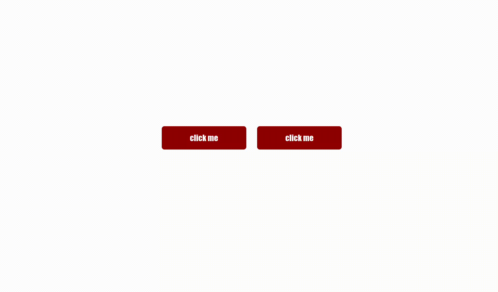

# Modal Handling JavaScript

This JavaScript code is designed to handle the display and hiding of modals using buttons. It assumes a specific HTML structure and uses classes to identify modal show and hide buttons.




## How to Use

1. Include the JavaScript code in your HTML file or link it externally.
2. Ensure that your HTML structure follows the expected pattern.
3. Add buttons with the class `modalShowBtn` to trigger modal display.
4. Add buttons with the class `modalHideBtn` inside each modal to close them.

## HTML Structure

```html
  <!-- Example of a button to show a modal -->
  <button class="modalShowBtn" data-target="#myModal">Show Modal</button>

  <!-- Example of a modal -->
  <div id="myModal" class="modal">
    <div class="modal-content">
      <!-- Modal content goes here -->
      <button class="modalHideBtn">Hide Modal</button>
    </div>
  </div>

## Before making any modifications, it is advisable to have a solid understanding of the principles of CSS, HTML, and JavaScript. Familiarize yourself with how these languages operate and their syntax to ensure effective and informed customization.
